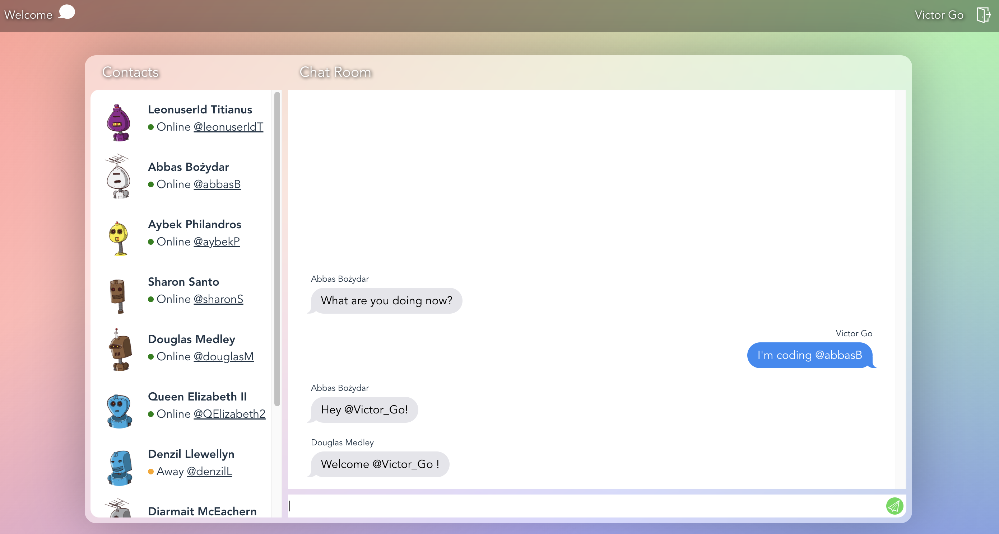

# Introduction
This is a sample chat room with very simple bots, it is developed by React Hooks. 

You could refer to this project for React Hooks learning.



# Features
- Wholly based on React Hooks.
- React Router for page switching.
- Redux for user and chat state maintenance.
- Custom Hooks.
- Native events.
- SCSS styling.

# npm
- Install dependencies
  ```
  npm install
  ```
- Run dev server
  ```
  npm run dev
  ```
- Build project
  ```
  npm run build
  ```
- Preview project
  ```
  npm run preview
  ```
- Run lint
  ```
  npm run lint
  ```
- Fix lint errors
  ```
  npm run lint:fix
  ```
